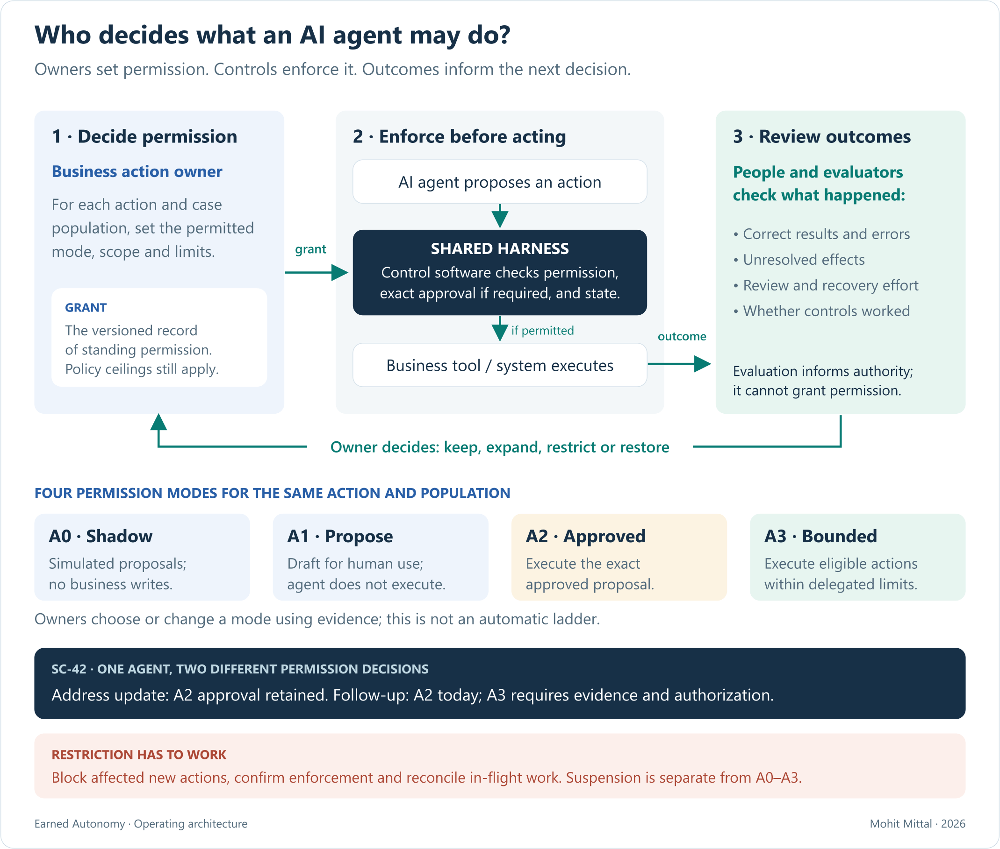
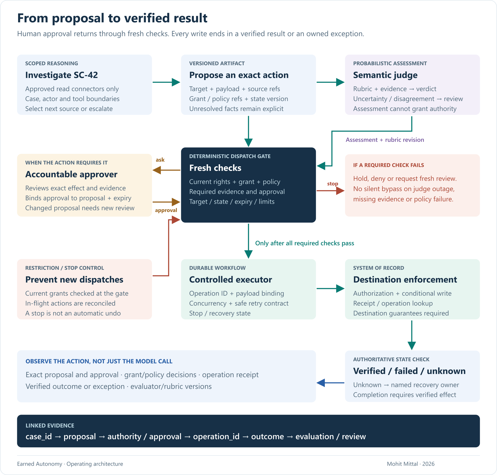
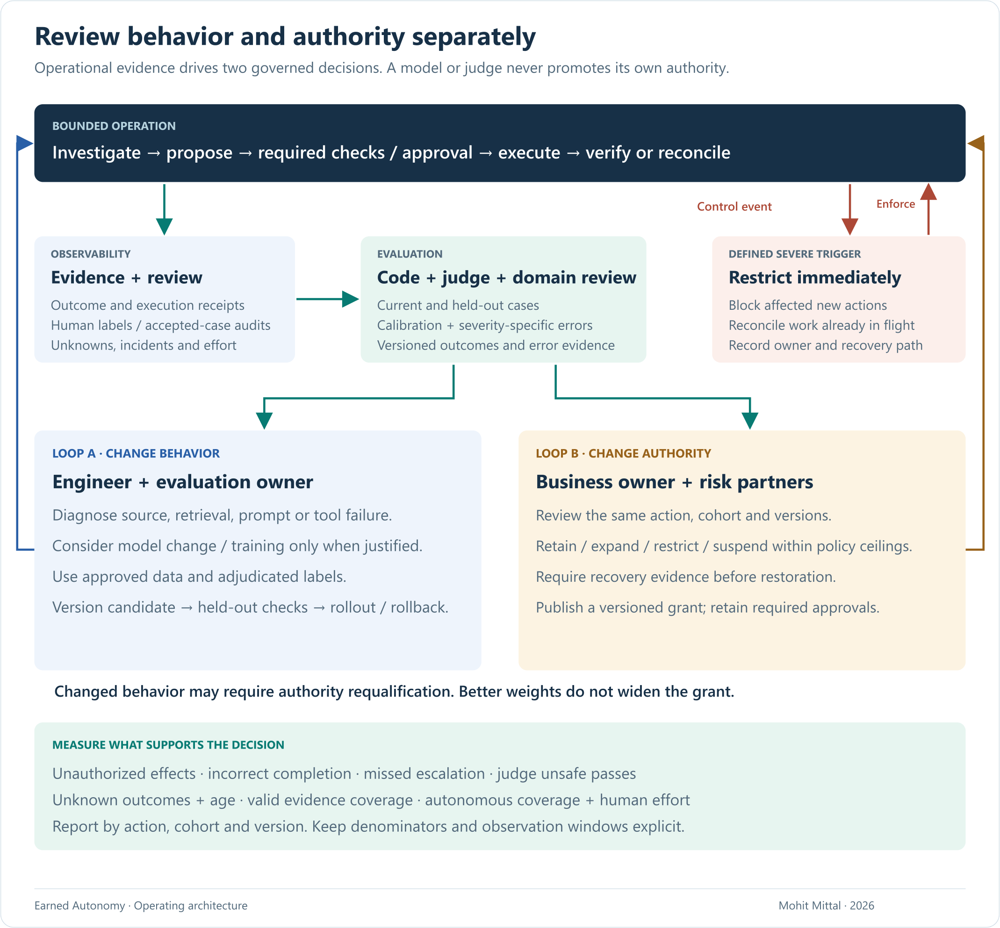

# Earned Autonomy: an operating model for agents that act

### Bounded investigation, verified execution and evidence-based changes in authority

*Mohit Mittal · September 2026*

**Use an agent where adaptive investigation improves resolution. Grant specific permissions, verify the consequences, and keep those permissions revocable.** Evaluation should improve the system and inform authority decisions through separate processes. The agent cannot promote itself, and a model upgrade does not remove a required approval.

[Six-minute visual brief](README.md) · [Detailed reference design](reference-design.md)

## First establish why an agent belongs

An advisor asks: **“Why is service case SC-42 still open, and what can we safely do next?”** The relevant evidence is spread across a request, servicing history, account status, documents and current rules. The next useful step depends on what the investigation discovers. A missing document, contradictory record and ambiguous policy call for different paths.

This is a plausible agent task: bounded investigation that selects among permitted sources and tools, identifies gaps, and proposes a resolution. The output is a package containing facts, source references, unresolved questions, proposed actions and the owner of any exception. A fixed checklist plus targeted extraction may still be sufficient; compare quality, elapsed time, human effort and cost before choosing an agent. [Workflow/agent distinction](https://www.anthropic.com/engineering/building-effective-agents)

In our synthetic case, investigation discovers a possible mailing-address mismatch. That finding does not authorize an update. The agent must distinguish an observed inconsistency from verified intent to change the record. Existing identity, fraud and servicing controls still apply.

Compliance is a constraint and an operating responsibility, not the sole reason to build an agent. [FINRA's 2026 discussion](https://www.finra.org/rules-guidance/guidance/reports/2026-finra-annual-regulatory-oversight-report/gen-ai) addresses supervision, monitoring and agent risks involving authority, auditability and sensitive data. This paper proposes engineering responses; it does not claim a regulator-prescribed design or compliance certification.

## Authority is a contract for an action

Treat an authority grant as a versioned record: **action, actor/delegation, scope, eligible cohort, environment, allowed mode, mandatory approvals, limits, expiry, validated system/configuration versions and accountable owner**. The registered capability describes what the agent can attempt; the grant describes what it may perform. Current policy and destination authorization can further restrict it.

For SC-42, permitted source access and draft preparation have bounded scopes. `create_internal_case` creates a linked internal specialist follow-up for SC-42; it starts approval-required. A later grant might allow selected follow-up types under explicit limits, or restrict the action to draft-only. The mailing-address update retains human approval in this design. Different actions do not inherit one another's permissions.

Expansion is multidimensional. A grant may cover more case types, a larger volume, a different environment or fewer discretionary reviews. Evaluate each change explicitly. Removing a discretionary review does not remove an approval mandated by applicable policy. “Read-only” still requires access controls and data-handling limits.

The user interface should state which action will happen, under whose authority, and which parts remain proposals. A broad instruction to investigate a case is not an instruction to send a client message, close an unresolved case or modify an account.

## Separate model judgment from the execution boundary

The agent investigates through scoped read connectors, then produces a structured proposal. Required evidence and semantic checks can block or escalate that proposal. Permission to perform the exact action is evaluated outside model instructions.

Bind approval to the target, exact field changes, supporting evidence, relevant record version, proposal expiry and applicable policy. At dispatch, recheck current entitlements, the authority grant, active policy, required approval and business preconditions. Invalidate materially changed proposals. An approved payload must not be rewritten by the model afterward.

The executor supplies durable operation identity and recovery state. The destination enforces authorization and conditional-write semantics where supported. Use a payload-bound idempotency key and supported operation lookup; a duplicate key with different intent is an error. These guarantees depend on the destination contract. [Retry semantics](https://aws.amazon.com/builders-library/making-retries-safe-with-idempotent-APIs/)

| Event | Required behavior in this design |
|---|---|
| Record, approval or relevant conditions become stale | Stop dispatch; obtain a corrected proposal and fresh review. |
| Authorization denies the action | Record denial; do not reinterpret it as a request to try another path. |
| Policy or required evidence is unavailable | Stop the affected consequential step; retain a draft and an owned exception. |
| Submitted write times out | Mark unknown; reconcile by operation identity and authoritative state before deciding whether retry is safe. |
| Only part of the workflow completes | Expose partial completion; use supported compensation or owned reconciliation. |
| Stop control activates | Prevent affected new dispatches; classify and resolve work already in flight. |

A lock around our own writers cannot constrain all external writers. If the destination cannot support adequate concurrency/reconciliation controls, keep the action draft-only until an alternative design is accepted. Do not promise exactly-once effects across unrelated systems.

MCP is a connectivity and protocol authorization mechanism, not the firm's action-approval model. Use audience-bound credentials and preserve destination authorization; token passthrough is prohibited in the referenced guidance. [MCP security](https://modelcontextprotocol.io/docs/2025-11-25/tutorials/security/security_best_practices)

## Evaluate three different things

**Correct judgment, permitted behavior and a completed business outcome are different claims.** Test each with evidence suited to it.

| Evaluator | Suitable questions | Evidence and limits |
|---|---|---|
| Deterministic checks | Are rights current? Is the payload exact? Did the expected state change occur without a duplicate effect? | Policy decisions, contracts, state queries and assertions. These checks cover what has actually been encoded and observed. |
| Semantic judge: LLM or Jev | Does the resolution follow the supplied evidence? Are important contradictions or gaps omitted? | A versioned rubric, relevant evidence and a verdict with uncertainty. The result is fallible, not an authorization token. |
| Domain reviewer | Is the proposed next step appropriate in this case? Is the rubric missing an important exception? | Adjudicated reference cases, disagreement review and sampling of accepted work. Human review also needs quality controls. |

Combining code, model and human evaluation is consistent with [Anthropic's agent-evaluation guidance](https://www.anthropic.com/engineering/demystifying-evals-for-ai-agents). This design evaluates the model, harness, sources, tools and controls together; a benchmark of the model alone is insufficient.

### Where Jev fits

TypeSafe's **Jev** returns typed choices, scores and probabilities rather than generated explanations. It is a candidate for frequent, narrow semantic checks. Its calibration across predictions does not guarantee an individual verdict. [System One documentation](https://docs.typesafe.ai/concepts/system-one)

For SC-42, ask a focused question such as: *“Is the proposed correction supported, contradicted, or unresolved by these supplied records?”* Provide explicit criteria for each answer, authoritative references and relevant excerpts. Preserve an `insufficient_evidence` route where appropriate. A binary yes-probability alone does not supply an abstention category.

Compare Jev with a conventional LLM judge on independently labeled cases. A generative judge can produce an explanation to help review, but that explanation is also an output to assess. Do not run multiple judges merely to manufacture consensus. Shared inputs, rubrics and training patterns can produce correlated errors.

Keep exact numeric/date comparisons and invariants in code. TypeSafe documents limitations with those tasks, indirect reasoning, irrelevant context and adversarial content. Test attacks aimed at the evaluator as well as the acting agent. [Jev 1.13 limitations](https://docs.typesafe.ai/model-jaggedness/jev-1.13)

Pin the judge version, question type, rubric, input manifest and routing threshold. Choice/Score confidence and Noul probabilities have different semantics; validate thresholds for the actual question and population. [Confidence documentation](https://docs.typesafe.ai/confidence)

[MLflow's comparison](https://www.mlflow.org/blog/jev-llm-judge/) provides a useful implementation example using 30 technical-QA cases. It does not establish performance on regulated servicing decisions. Choose a judge on domain error rates, calibration, review burden, latency and total cost—not vendor-wide accuracy claims.

### Evaluation before deployment and during operation

Before deployment, build domain-labeled cases covering normal work, ambiguous intent, missing/conflicting sources, wrong-account selection, revoked rights, malicious document instructions, stale approvals, retries and partial outcomes. Include repeated trials for variable behavior and separate held-out cases from development/tuning cases. Check the final state and the path, not just the wording of the answer.

During operation, run required policy and execution checks on every applicable action. Use configured pre-action semantic checks where the action contract requires them; an unavailable required evaluator routes to the defined hold/review path. Sample other semantic assessments asynchronously, alongside outcome monitoring and human audits. Retrospective evaluation cannot undo an unsafe effect.

Review accepted cases as well as escalations. Record sampling probabilities and risk strata so aggregate estimates are not mistaken for an unbiased population measure. Domain reviewers adjudicate disagreements and periodically review one another's labels. Watch missed escalations, unsafe passes and false rejections separately; overall agreement can conceal the errors that matter most.

## Two feedback loops, two decisions

**The improvement loop changes behavior.** Investigate the cause before selecting the remedy. Incorrect source material needs correction; poor retrieval needs better selection; ambiguous instructions need clarification; a retry defect needs an execution fix. Consider another model or offline training for persistent behavior gaps supported by suitable, reviewed data. Keep current policy in authoritative sources and enforceable rules; weights are not a reliable store of changing permissions.

Training requires approved data use, curation/redaction, labels with provenance, separate training and held-out sets, a versioned candidate, regression evaluation and a rollout/rollback decision. Raw traces, user corrections and judge verdicts are inputs for adjudication, not automatically training truth. This proposal does not assume Jev offers customer fine-tuning. Evaluate the whole system after a model change and review any authority grant whose evidence it invalidates.

**The authority loop changes permission.** The business action owner reviews outcome quality, control coverage, residual risk, operational capacity and benefit with applicable risk/security partners. The result is a versioned grant to retain, expand, restrict or suspend an action for a defined cohort. A run can select a more cautious path inside that grant; it cannot widen the grant itself.

| Decision | Evidence or trigger | Operating response |
|---|---|---|
| Expand deliberately | Representative evaluation and supervised/shadow results; severity-specific errors within agreed limits; judge calibration; complete required evidence; tested recovery; lower total effort | Approve a narrowly defined grant change and controlled rollout. Keep mandatory approvals. |
| Restrict proportionately | Sustained adjudicated defects, missed escalation or unresolved operations against defined windows and minimum samples | Reduce eligible scope, require approval or return to draft-only mode. Assign a repair owner. |
| Suspend promptly | A predefined severe event such as an unauthorized write or confirmed authorization bypass | Block affected new actions, preserve evidence and reconcile in-flight work. |
| Restore after repair | Root cause addressed, relevant regressions passed, observation criteria satisfied and owner decision recorded | Reinstate a specified grant; monitor the restored cohort. Do not reset history. |

Agree criteria before looking at pilot outcomes. Separate restriction and restoration thresholds/windows to avoid repeated switching on noise. Distribution shift is a signal to investigate; low override rates may reflect rubber-stamping. Zero failures in a small sample do not establish that rare events are acceptably unlikely. Material source, tool, model, judge or policy changes require impact review and relevant requalification.

## Observe what makes autonomy defensible

Correlate **case → action/proposal → authority grant → policy/approval → operation → verified outcome → evaluation/review**. Record model/tool/rubric versions and concise evidence-backed decision factors; hidden reasoning is unnecessary. Keep sensitive payloads in an access-controlled evidence store with appropriate retention, legal-hold and deletion processes. An append-only table alone is not tamper-proof evidence.

Report metrics by action, risk cohort, environment and system/judge/policy version. Use a defined observation window and outcome-maturity rule; show samples, pending work and severity. The following measures are proposed for this design.

| Measure | Definition | What it changes |
|---|---|---|
| Unauthorized effects | Count/severity of effects outside valid scope or approval; also report executed-action count | Containment and control repair. Track blocked attempts separately. |
| Incorrect completion | Adjudicated wrong/incomplete outcomes / reviewed completion claims | Verification, scope or approval requirements; disclose sampling. |
| Missed escalation | Adjudicated cases requiring escalation that were not escalated / all adjudicated cases requiring escalation | Routing and autonomy limits. |
| Unnecessary escalation | Avoidable escalations / reviewed escalations | Context/routing quality and reviewer capacity. |
| Unknown outcomes | Dispatched operation IDs unresolved beyond the agreed interval / dispatched operation IDs; plus oldest age | Reconciliation capacity and new-write restrictions. Count operations, not retries. |
| Evidence completeness | Actions with all required valid linked records / actions requiring those records | Evidence pipeline repair; completeness is not correctness. |
| Judge unsafe-pass rate | Unacceptable cases passed / adjudicated unacceptable cases | Evaluator selection, thresholds and review routing. Also report false rejection and domain calibration. |
| Autonomous coverage | Eligible cases correctly resolved without intervention / eligible cases in a matured cohort | Useful scope of automation, paired with quality. Hold eligibility rules stable; show pending and abandoned cases. |
| Human effort and correction | Total handling/review/exception/rework minutes per eligible case; material corrections / reviewed proposals | Whether work was removed or shifted; low correction counts alone are inconclusive. |
| Time to restrict | Detection-to-enforced-restriction time, with unresolved in-flight operations | Whether revocation works in drills and incidents. |

A verified account update completes an action. SC-42 closes only when the servicing workflow's separate resolution conditions are satisfied and closure is authorized and confirmed. A case requiring human approval does not count as resolved without intervention. Report automated investigation or action coverage separately; reduced human effort can establish value even when whole-case autonomous coverage is zero.

Sampled judgments estimate quality with uncertainty; do not represent them as complete observation of all autonomous outcomes. Validate reported probabilities against human-adjudicated outcomes by rubric and cohort. Use a calibration curve and a proper scoring measure where appropriate rather than interpreting confidence as a universal reliability score.

Total cost per correctly resolved case includes the model, judges, platform and human work across the whole cohort, including unsuccessful attempts. Compare comparable case mixes and mature outcome windows against the prior workflow. Faster investigation is valuable only if review and reconciliation do not consume the gain.

## Make the operating model executable by people

The business owner defines eligible work and grants; operations/domain experts define outcomes and adjudicate exceptions; engineering owns execution and recovery; the evaluation owner maintains cases and judge quality; security/risk partners establish applicable constraints; platform owners maintain identity, connectors and evidence services. These are responsibilities, not necessarily new teams.

Begin with one case class in shadow or supervised mode and a staffed exception path. Rehearse denial, unknown outcomes and stop/recovery before increasing exposure. The second use case should reuse action contracts and evidence interfaces without copying a bespoke harness.

The investment is a resolution capability with an accountable operating loop. **Earned autonomy means permission supported by evidence—and a working mechanism to take it back.**

---

**Author perspective:** My work includes enterprise architecture, production LLM/RAG systems at Chegg, and governed agent infrastructure and MCP servers in healthcare. SC-42, the product placements and the evaluation artifacts are independent design proposals; no financial-services deployment, benchmark or savings result is claimed.

[Reference design and evidence record](reference-design.md) · [Sources](SOURCES.md) · [Separate AI-DLC architecture](https://github.com/appliedgenai/intent-to-production)
