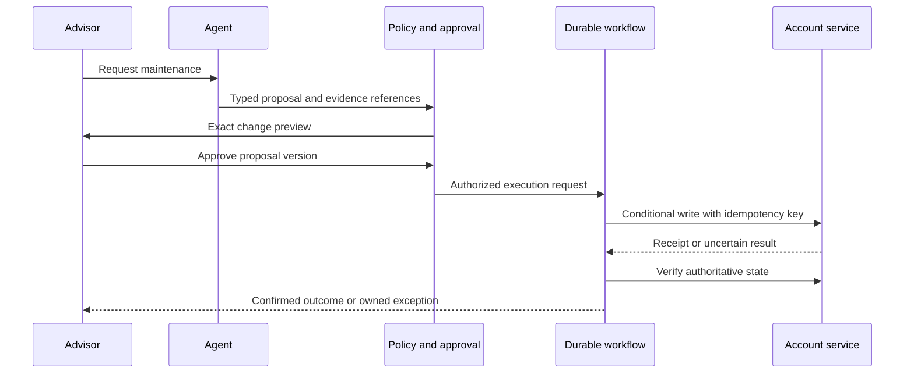

# Agents you can audit

### Autonomy is earned in the exception path.

*Mohit Mittal · September 2026*

An advisor approves an agent's proposed account update. Before it executes, an operations specialist changes the same record. The agent submits the original request, the downstream service times out, and the agent retries.

Was the approval still valid? Did the first request succeed? Did the retry create a second workflow? Who owns the resolution?

These are the questions that separate a convincing demo from a dependable platform. The model can interpret the request correctly and the system can still fail the advisor.

**My design rule: give autonomy to a bounded business action with a verifiable outcome, not to an agent with a persuasive answer.**

## The contract comes before the tool

A tool schema describes arguments. An action contract describes what the business is allowing to happen.

For an illustrative mailing-address maintenance workflow, the contract includes the authorized actor and account relationship, permitted fields, required evidence, approval conditions, expected record version, completion criteria, recovery owner and evidence retention class. Address changes can carry fraud, tax and jurisdiction implications; they are not automatically low risk.

Keep identity verification and the firm's existing business controls. A natural-language interface should not create a second, weaker path around them.

The action's permitted scope is the intersection of the user's current rights, the agent's registered capabilities, the workflow policy and the approved change. None of these alone grants authority.

## Approval has a version

Human approval is often implemented as a Boolean. That loses the most important information: **what the person actually approved**.

Bind the approval to an immutable proposal containing the target record, exact permitted field changes, supporting evidence references, record version and expiry. Record the applicable policy version. At execution, recheck current entitlements, active policy and relevant business preconditions. If these change materially, invalidate the proposal and request fresh review.

The reviewer should see a concise before/after comparison, provenance and warnings. The approved payload must be the payload executed; the model must not rewrite it after approval.

This adds friction when records change frequently. Reduce it by checking only relevant versioned state and keeping proposals short-lived. Do not solve stale approvals by silently widening their scope.

## Put execution behind a durable workflow

Let the model extract intent and prepare a proposal. Let deterministic services authorize and execute it.

The gateway checks identity and policy; the destination service also enforces authorization and concurrency controls. A central gateway without downstream enforcement leaves bypass paths.

[MCP authorization](https://modelcontextprotocol.io/specification/2025-11-25/basic/authorization) provides a protocol foundation for protected HTTP services. It does not supply the firm's business entitlements or approval model. Validate audience-bound tokens and use appropriately scoped credentials for downstream systems; [token passthrough is prohibited by MCP security guidance](https://modelcontextprotocol.io/docs/2025-11-25/tutorials/security/security_best_practices).

In my healthcare architecture work, building the harness and MCP servers made the enforcement boundary tangible. Here, the financial-services workflow is a proposed application of those engineering principles, not a claim of an existing deployment.

## Unknown is an outcome, not an invitation to retry

Distributed systems do not become transactional because an agent calls them.

| Failure | Required behavior in this design |
|---|---|
| Record changes after approval | Reject stale execution; create a new proposal. |
| Write times out | Mark outcome unknown; query by operation ID or reconcile authoritative state. |
| Duplicate request arrives | Return the existing operation result using an idempotency key and payload binding. |
| One of several systems updates | Record partial completion; use a supported compensating workflow or route to an owner. |
| Policy or entitlement service is unavailable | Stop new writes; preserve a draft or queue for review. |
| Permission is revoked mid-workflow | Recheck before the next consequential step; do not rely on the initial approval. |

Use conditional writes where the destination supports them. Where it does not, a per-account workflow lock can help coordinate your own writers, but cannot protect against every external writer. Read-back checks, restricted scope and manual reconciliation remain necessary. Do not promise exactly-once execution across unrelated systems.

A kill switch stops new actions. It also needs a runbook for actions already in flight: determine which can be cancelled, which must finish, and which need reconciliation.

## Earn autonomy with evidence about each action

Start with drafts, then supervised execution for a narrow population. Expand only when the action's outcome quality, exception load and operational controls support it. Keep higher-impact actions outside the initial scope.

Evaluation should test the business state and the path taken to reach it. Include wrong-account selection, stale source data, revoked rights, duplicate requests, injected document instructions, policy outages and uncertain writes. Run disruptive cases in isolated test environments; do not insert deliberately flawed items into live customer work.

Measure separately by workflow, risk class and account population. A high overall success rate can conceal a dangerous minority case. Zero failures in a small pilot does not establish that rare failures are acceptably unlikely.

Promotion requires a named business owner, security/risk review, a defined observation period and an agreed error budget. Control breaches should disable the affected action immediately; noisy quality signals need a documented threshold and a human-owned recovery process.

## Evidence should explain the action without copying everything

Retain the actor and delegation, proposal identifier, relevant source versions, policy decision, approval, tool version, execution receipt and verified outcome. Link operational traces to a restricted evidence store.

Record concise decision factors and source references; do not rely on hidden model reasoning or retain unrestricted prompts containing client data. Access controls, retention schedules, legal holds and deletion rules must be designed together. An append-only application table alone is not tamper-proof evidence.

[FINRA's 2026 report](https://www.finra.org/rules-guidance/guidance/reports/2026-finra-annual-regulatory-oversight-report/gen-ai) identifies agent risks involving authority, auditability and sensitive data. The mechanisms here are engineering proposals to address those concerns, not a regulator-prescribed architecture or a compliance certification.

## The real test is recovered capacity

Track human minutes per eligible request from arrival through resolution, including approvals, exceptions and rework. Report that alongside correct completion, denied actions, unresolved outcomes, complaints and cost per completed workflow.

An agent that reduces data entry but increases specialist reconciliation has moved work. An agent that safely closes the loop has created capacity.

That is the autonomy worth earning.

---

[Inspect the reference design](reference-design.md) · [Read the delivery companion](01-operating-model-wins.md) · [Sources and scope](SOURCES.md)
