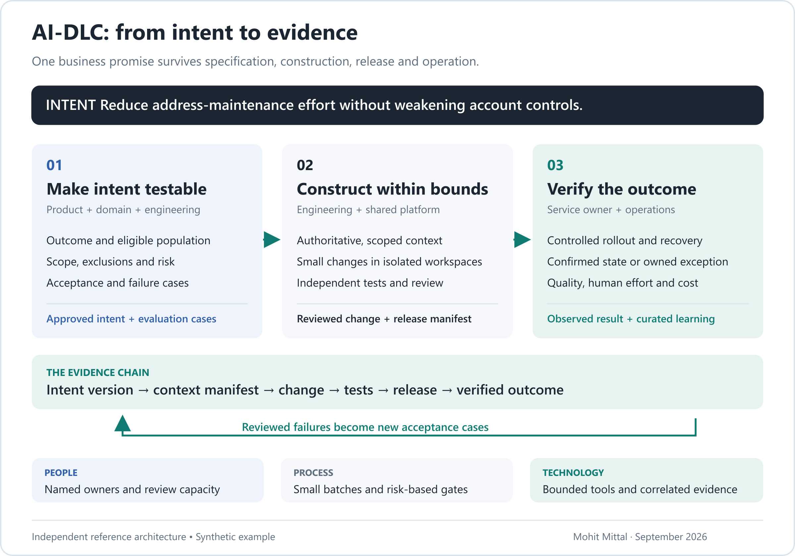

> Earlier delivery essay. The current six-layer architecture, tool map and integration contracts are in [Intent to Production](https://github.com/appliedgenai/intent-to-production). This repository’s main paper is [Earned Autonomy](README.md), on agent action authority.

# AI-DLC: From Intent to Evidence

### The ecosystem behind dependable AI-native software delivery

*Mohit Mittal · September 2026 · Executive read: approximately six minutes*

An operations leader asks for a simple improvement: let advisors prepare a client address change without navigating several screens. A coding agent can generate the form and service call quickly. But the business has not asked for a form. It has asked for a correctly resolved request, with less effort and the same protection against unauthorized or duplicate changes.

That difference is where an AI development lifecycle begins.

**The unit of delivery should be a business intent linked to evidence that it was fulfilled.** Code, prompts, models, tests and deployment configuration are the versioned means of fulfilling it.

My perspective comes from enterprise architecture, production LLM/RAG work at Chegg, and building governed agent infrastructure and MCP servers in healthcare. The example here is a proposed financial-services design, not a claimed production case study.

## Start with the result; make the assumptions visible

For the address-change feature, product and operations write the intent together: reduce handling effort while preserving verification, account permissions and a reliable completion record. They define exclusions, representative cases and failure behavior before implementation.

“Update the address” becomes a reviewable contract: the wrong account cannot be changed; stale approval requires review; an uncertain write is reconciled; an unresolved request has an owner. Acceptance tests express those promises. A task list alone cannot.

This fits the emphasis on human validation across inception, construction and operations in [AWS's AI-DLC methodology](https://aws.amazon.com/blogs/devops/ai-driven-development-life-cycle/). The six-layer architecture below is my proposed implementation model, not an AWS-prescribed stack.

## Six responsibilities; a connected ecosystem

The layers operate across the lifecycle. They are neither six sequential handoffs nor six products to procure. Control and observability apply throughout.

**L6 — Intent:** capture the outcome, constraints, owner and acceptance evidence. Buy or reuse planning and specification tools. Own the intent template, decision rights and definition of done.

**L5 — Knowledge:** connect existing code, architecture decisions, API contracts, policies and runbooks. Adopt catalog and search capabilities. Own authoritative sources, freshness, access mappings and domain terminology. A new vector database cannot resolve conflicting policy owners.

**L4 — Context:** assemble the evidence this task needs. Adopt retrieval infrastructure and connectors. Own permission filtering, source versions, context budgets and a manifest of what reached the agent. Retrieval relevance and authorization are different tests.

**L3 — Execution:** let agents propose plans, code and tests inside bounded workspaces. Buy or adopt coding agents, model access and orchestration. Own task decomposition, approved tool adapters, environment boundaries and recovery. Use deterministic automation where the path is known.

**L2 — Control:** evaluate the change and govern release. Reuse CI/CD, security scanners, policy engines and evaluation runners. Own risk rules, representative evaluations, reviewer routing and release criteria. The agent proposing a change must not be its only judge.

**L1 — Evidence and learning:** connect intent, changes, approvals, release identity and observed outcomes. Adopt telemetry and durable storage. Own the correlation model, retention rules and the process that turns reviewed failures into future tests. Raw agent memory is not organizational knowledge.

**Buy common capabilities. Build the contracts that express how your business works.** Much of that work is configuration, schemas and integration—not a new platform service. The [layer-by-layer playbook](ai-dlc-implementation-playbook.md) includes the build/buy matrix, product examples, ownership and acceptance checks.

## People and process determine whether the technology helps

The product owner remains accountable for the outcome. Operations specialists supply the exceptions. Engineers own the design and correctness of merged changes. Platform teams provide reusable environments and controls. Security and risk partners define proportionate constraints. Service owners run the result.

The operating rhythm changes: a short intent-and-risk discussion; small, reviewable implementation slices; independent evaluation; controlled rollout; then an outcome review. Clarification stays close to the work. Approval volume is not a substitute for judgment.

Non-coders contribute requirements, examples and supervised prototypes. Production access still follows the same ownership and release rules. Engineers need time to review and develop domain understanding; a larger generation queue without review capacity simply moves the bottleneck.

## Observe the agent and the work it changes

In our example, an agent can report success while the destination write remains uncertain. Observability must make that difference visible.

A delivery trace connects intent, context versions, tool calls, code changes, tests and release. A separate production trace connects the advisor request, authorization, write and verified outcome. Link both through the release identity; do not mix their permissions or retention policies.

Use [OpenTelemetry GenAI conventions](https://github.com/open-telemetry/semantic-conventions-genai) where applicable, with pinned instrumentation versions and deliberate content redaction. Trace IDs, concise decision factors and source references are useful; unrestricted prompt capture is not a prerequisite.

This gives engineering a failed step to diagnose, operations a request to recover, and product an outcome to measure.

## Measure the constraint, not the excitement

Pair intent-to-production lead time and review waiting time with change failures, rework, and total cost per accepted change. Then measure the actual advisor workflow: handling effort, correct completion and unresolved requests. Keep [DORA's delivery measures](https://dora.dev/guides/dora-metrics/) distinct from the broader intent-to-outcome measures proposed here.

**A lower coding cost can coexist with unchanged delivery time.** A faster release can coexist with no business benefit. Report both, including rejected attempts, human review and operational overhead. Compare similar work within a service; do not turn developer activity into a ranking system.

In the [playbook's illustrative calculation](ai-dlc-implementation-playbook.md#worked-example-cheaper-construction-is-not-yet-faster-delivery), implementation effort falls 60%, but total human effort falls only 33% once review and rework are counted. Delivery time remains unchanged because the queue remains. These are example inputs, not employer results; the playbook provides metric definitions and data sources.

## The pattern to repeat

Start with one workflow and the tools already in place. Make intent explicit, assemble trustworthy context, constrain execution, validate independently and measure the outcome. Then prove a second domain can reuse the same interfaces.

Avoid the opposite sequence: buy a collection of agents, connect everything, generate large changes and add governance after the first incident.

For the advisor, the story ends with a request correctly resolved. For the engineering organization, it ends with a capability it can deliver again—with less friction and a record of why the result deserves trust.

---

**Explore the architecture:** [Build/buy, people, patterns and metrics](ai-dlc-implementation-playbook.md) · [Worked intent contract](examples/ai-dlc-intent.md) · [Runtime companion: Agents you can audit](02-agents-you-can-audit.md)

Independent architecture proposal. [Source notes and boundaries](SOURCES.md).
