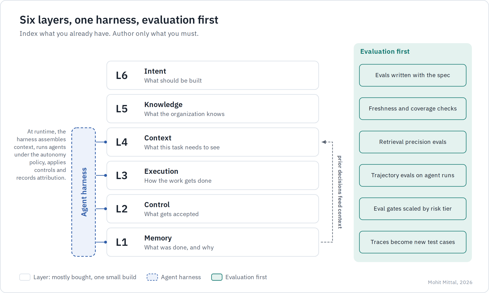

# Earned Autonomy

### From an advisor's request to work actually resolved.

**A six-minute visual brief · Mohit Mittal**

An advisor is preparing for a client meeting. The client's mailing address needs correcting. An assistant could find the account, prepare the change and initiate the maintenance workflow—giving the advisor more time for the conversation.

But preparing a change and safely completing it are different problems. **The opportunity is to close more work, with less human effort, while preserving control over every action.** Here is the operating model I would use for that journey.

## 1 · Give the assistant the right amount of authority

*First 90 seconds · Start with the business action*

The assistant may summarize information, draft a follow-up and schedule a meeting. Those actions do not deserve identical permissions. For our address-change example, start with a verified proposal and human approval; existing identity, fraud and account rules remain authoritative.

**Autonomy belongs to the action.** Expand it only when that workflow's outcomes, exception load and control evidence justify the move. A better model does not automatically earn broader business authority.

*The ladder is illustrative, not a universal policy. Quality drift follows defined thresholds; a control breach restricts the affected action immediately.*

## 2 · Make the approved action survive contact with reality

*Next two minutes · Design the difficult part*

The advisor approves the address change. Before execution, operations updates the same record. Later, a submitted write times out. A naive retry could repeat a change that already succeeded.

Three architectural decisions resolve the ambiguity:

- **Bind approval to the exact proposal and record version.** Changed relevant data means fresh review. Recheck permissions and policy before writing.
- **Treat an uncertain result as a state to reconcile.** Use an operation ID, conditional writes and duplicate prevention where the destination supports them. Never assume a timeout means nothing happened.
- **Verify the business outcome.** Tell the advisor “completed” only when authoritative state confirms it. Otherwise show an owned exception, with the evidence needed to resolve it.

*The allowed path includes durable execution and destination-side authorization. Human approval does not bypass those checks. MCP connects tools; it does not supply the business policy.*

Now the assistant can close the request—or explain precisely why it cannot. The advisor is not left guessing, and operations does not inherit an invisible failure.

## 3 · Turn one dependable workflow into a reusable capability

*Next 90 seconds · Connect runtime discipline to delivery*

The next team wants a similar capability. Rebuilding the controls would make every use case another integration project. This is where the software-delivery operating model matters.

For the same address-change workflow: **Intent** defines completion and exclusions. **Knowledge** supplies account rules and API contracts. **Context** brings only authorized, current evidence. **Execution** prepares and performs bounded work. **Control** tests and enforces the rules. **Memory** links approvals to verified outcomes and future evaluations.

The shared platform owns common identity, gateways, registries and evidence interfaces. Domain teams own business rules, acceptance cases and recovery. The reuse test: a second domain adopts the same contracts without creating another harness or audit pipeline.

*The diagram's “small build” expresses a preference for reuse, not an integration estimate. Traces require curation and redaction before becoming test cases.*

## The ending: did the advisor get time back?

*Final minute · Prove the outcome*

A fast proposal is not the result. A correctly resolved request, with less total human effort, is.

**Recovered capacity = baseline human effort − handling, review, exception and rework effort after automation.**

For this pilot, measure human minutes per eligible request, verified completion, unresolved outcomes, exception age and total workflow cost. Keep quality visible beside speed. Expand only when the evidence supports both.

That connects the two halves of the architecture: a delivery model that makes dependable capabilities repeatable, and an execution model that earns the right to act. The business gets capacity it can measure, with an explanation for every consequential change.

## Optional detail

[Agents you can audit](02-agents-you-can-audit.md) · [Operating model wins, not tooling](01-operating-model-wins.md) · [Reference design and failure cases](reference-design.md)

**About me:** I'm Mohit Mittal, a Chief Architect with 22+ years in enterprise architecture and distributed systems. My experience includes governed agent infrastructure and MCP servers in healthcare, and production LLM/RAG systems at Chegg. My focus is translating architecture into enforceable behavior and measurable business outcomes.

Independent engineering proposals; the scenario is synthetic, not a claimed deployment. [Sources and scope](SOURCES.md) · [CC BY 4.0](LICENSE.md). Select a diagram to view it at full resolution.
