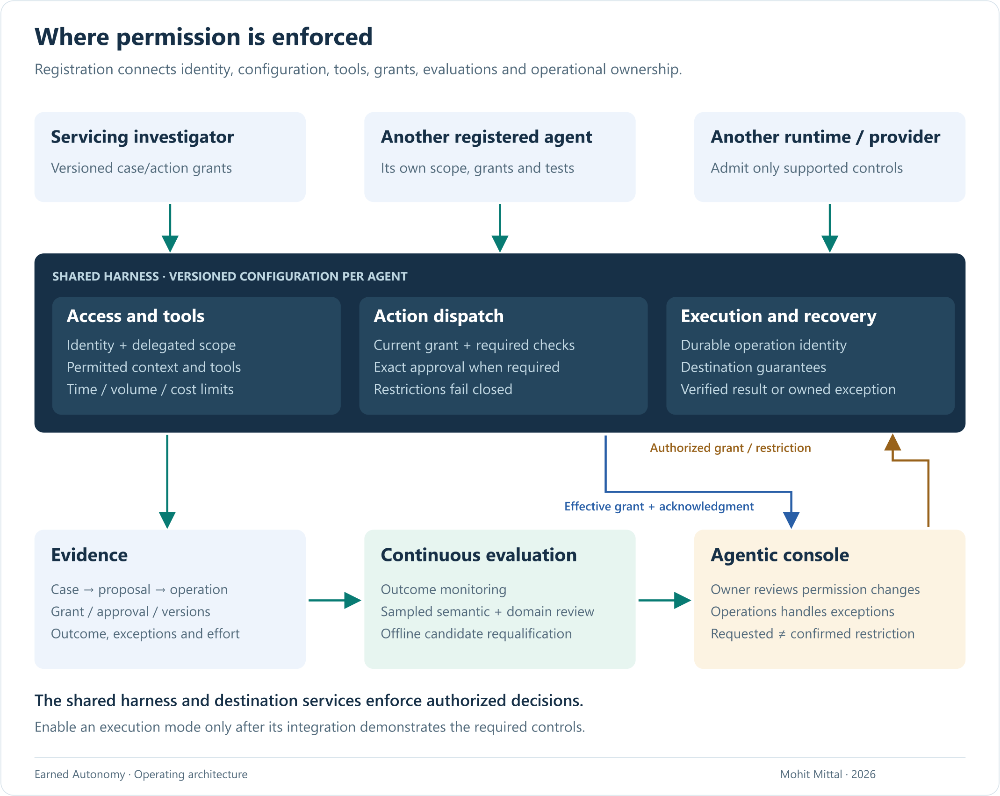
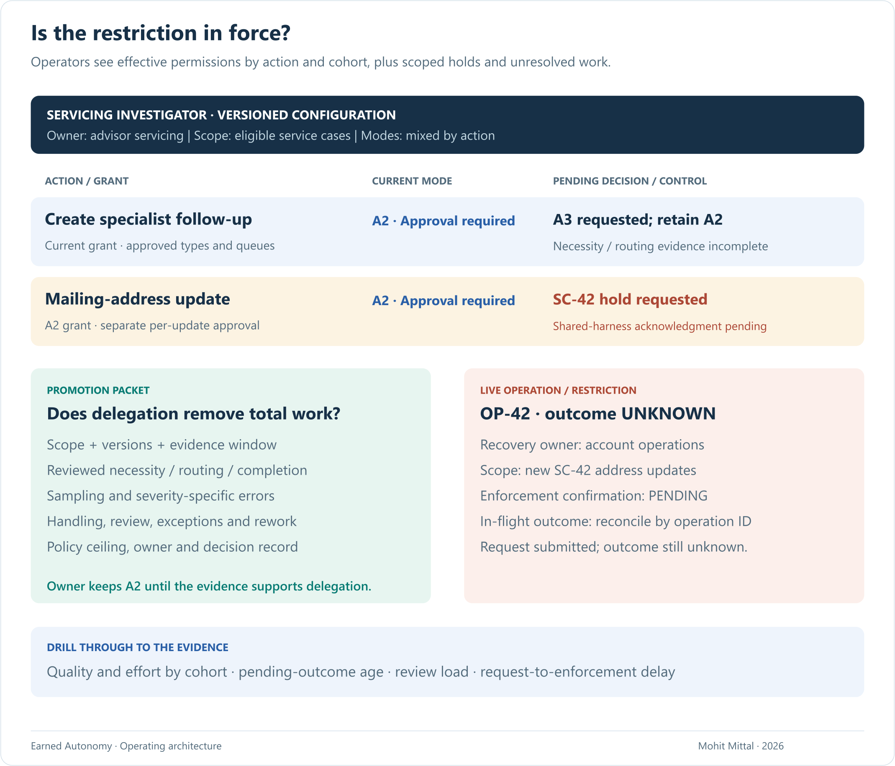

# Earned Autonomy

### Give agents bounded authority. Expand it when verified outcomes justify it. Keep it revocable.

**Agent autonomy in regulated operations · Mohit Mittal · September 2026**

An agent can explain why a client-service request is stuck. Letting it create a follow-up task or change an account record is a separate decision.

**Earned autonomy means giving agents permission for specific actions, expanding it only when policy and verified outcomes justify it, and keeping it revocable.** The goal is correctly resolved work with less total advisor and operations effort.

Three decisions shape the architecture:

- **Delegate each action separately.** One agent may create an internal task while still needing approval to update an account.
- **Require evidence before expanding permission.** A better model does not automatically earn more authority.
- **Enforce and monitor permission outside the model.** Operators must be able to restrict new actions and resolve work already in progress.

**Six-minute scan:** follow the six takeaways and captions. All six diagrams are on this page; select any image for full resolution.

[Permissions](#permission-modes) · [Harness](#shared-harness) · [Execution](#execution) · [Console](#operator-console) · [Evidence](#evidence-record) · [Evaluation](#evaluation-loop)

## One service case, two different permissions

An advisor asks: **“Why is this client's account-maintenance request still open?”** In our fictional case, **SC-42**, a submitted document and the account record show different mailing addresses. The agent checks permitted case history and supporting records to establish what is missing. Use an agent when the next investigative step depends on what it discovers; a fixed checklist may otherwise suffice.

The discrepancy does not establish the client's intent. The agent can draft a correction, subject to required verification and approval. If evidence needs specialist review, it can propose a separately authorized internal follow-up task to resolve that gap.

The address update illustrates controlled execution; the follow-up illustrates an action that could later earn more autonomy.

## 1 · What may this action do?

**Choose the permission for this action and these cases.** Our four modes are A0: shadow with no business effects; A1: draft only; A2: execute after approval; A3: execute within delegated limits. These are proposed design terms, not a mandatory progression.

*Both actions start with approval required (A2). Only follow-up creation is considered for bounded execution (A3) here. Shadow results cannot demonstrate that actual writes or recovery work.*

## 2 · What makes that permission enforceable?

**Use one shared control layer, called a harness, around the agents.** It checks access, enforces limits, records outcomes and routes exceptions. A *grant* records standing permission and limits; an *approval* authorizes one exact proposal. Changes to grants are versioned.

*Each agent has its own configuration and accountable owner. Integrations must support the required controls before execution is enabled.*

## 3 · What happens before a business change?

**Check the exact proposal, approval and current permissions before sending the action.** An AI evaluator—an LLM judge or TypeSafe's Jev—can assess whether evidence supports the proposal. It must first be tested against domain-expert judgments; its verdict cannot grant permission. [Evaluator limits](earned-autonomy-operating-model.md#where-jev-fits)

*In our example, required verification establishes the intended address change. An authorized reviewer approves the exact proposal, and fresh checks permit execution. Its response times out: operation **OP-42** may have succeeded, so the system must establish what happened before deciding whether to retry.*

## 4 · Can operations see and restrict what is happening?

**Give operations a console showing what agents may do and what needs attention.** It must distinguish a requested restriction from confirmation that the execution system has enforced it.

*Follow-up creation still needs approval because necessity and routing evidence are incomplete. While account operations investigates OP-42's unknown outcome, it requests a temporary hold on further address updates for this case. Confirmation is pending; that hold cannot undo an update already sent.*

## 5 · Can we reconstruct the result?

**Keep enough evidence to explain who approved what and what actually happened.** Later, operations looks up OP-42 and compares the account system's state with the approved change.

*The update is confirmed without repeating it. That completes one action; closing SC-42 requires separate resolution checks and authorization. Human-approved work can save effort without making the whole case autonomous.*

## 6 · What earns—or removes—the next permission?

**Use operating evidence for two decisions: what to fix, and what to permit.** Check each action as required, review outcomes and samples—including apparently successful cases—and test proposed changes on cases reserved for evaluation.

*Engineers improve sources, retrieval, prompts or tools; model training is optional. Business owners and risk partners review permissions. Predefined severe events trigger restrictions, with repair evidence and authorization required for restoration.*

**The follow-up decision:** retain approval until policy permits delegation and evidence shows necessary, correctly routed tasks, reliable recovery and less total human work. Then consider a limited grant for named case types and queues, with limits and expiry. The address update still needs approval.

Track incorrect or unauthorized changes, missed escalations, errors evaluators accept, unresolved-operation age, time to enforce restrictions and total human effort. Compare by action, case type and version, with explicit denominators, review coverage and observation windows. [Metric definitions](earned-autonomy-operating-model.md#observe-what-makes-autonomy-defensible)

## The investment decision

Start with one case type. Compare correct resolution, total human effort—including review and recovery—and cost with the current process. Expand where the evidence supports value; reuse the controls for a second action and qualify it independently.

**The future of AI depends on disciplined engineering.**

[Full paper](earned-autonomy-operating-model.md) · [Worked reference design](reference-design.md) · [Sources](SOURCES.md)

---

**Author:** Mohit Mittal, Chief Architect, with 22+ years in enterprise architecture and distributed systems, including production LLM/RAG work at Chegg and governed agent infrastructure and MCP servers in healthcare. SC-42, the console and promotion decisions are illustrative designs, not employer deployments or measured results.

[Separate AI-DLC architecture](https://github.com/appliedgenai/intent-to-production) · [CC BY 4.0](LICENSE.md)
