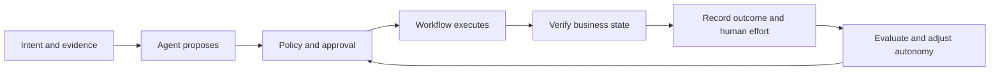

# Earned Autonomy

### Turn agent actions into advisor capacity you can prove.

**An agent can finish its task while leaving the business with more work.** A fast draft still needs review. A timed-out write may already have succeeded. An approval may refer to account data that has since changed.

The architecture has to account for the whole workflow: who may act, what exactly was approved, whether the change happened, and how much human effort remained.

This portfolio connects two operating models: how teams deliver AI-enabled software and how agents earn permission to act inside it.

| Start here | What you will take away |
|---|---|
| **[Agents you can audit](02-agents-you-can-audit.md)** · 6 minutes | Bind approval to an exact action; handle stale state and uncertain outcomes; expand autonomy using evidence. |
| **[Operating model wins, not tooling](01-operating-model-wins.md)** · 6 minutes | Six delivery layers, clear platform/domain ownership, and a way to measure whether AI removes work or moves it. |
| **[Account-maintenance reference design](reference-design.md)** · 5 minutes | One synthetic workflow, an action contract, failure cases, and a staged pilot plan. |

Three design choices carry the argument:

1. **Approval has a version.** Bind it to the proposed change, target, data version and expiry. A material change invalidates the approval.
2. **Unknown is a real outcome.** A timeout is not proof of failure. Reconcile the downstream state before retrying.
3. **Capacity is measured after exceptions.** Count review, correction and recovery time before claiming savings.

The [sample action contract](examples/action-contract.json) and [evaluation cases](examples/evaluation-cases.json) make those choices inspectable. They are design examples, not a running agent or production policy engine.

## About the author

I'm **Mohit Mittal**, a Chief Architect with 22+ years in enterprise architecture and distributed systems. My experience includes generative and agentic AI in regulated healthcare, building an agent harness and MCP servers, and bringing LLM and RAG systems into production at Chegg.

My interest is the boundary between architecture and implementation: the policy decision, the tool call, the failed dependency, and the evidence that shows whether the business outcome improved.

## Scope

These are independent engineering proposals. The account-maintenance workflow is synthetic; it does not describe an employer's or financial institution's internal implementation. Sources support the external context, not a claim that this design has been deployed or independently validated. See [sources and claim boundaries](SOURCES.md).

Written September 2026. Content licensed under [CC BY 4.0](LICENSE.md).
