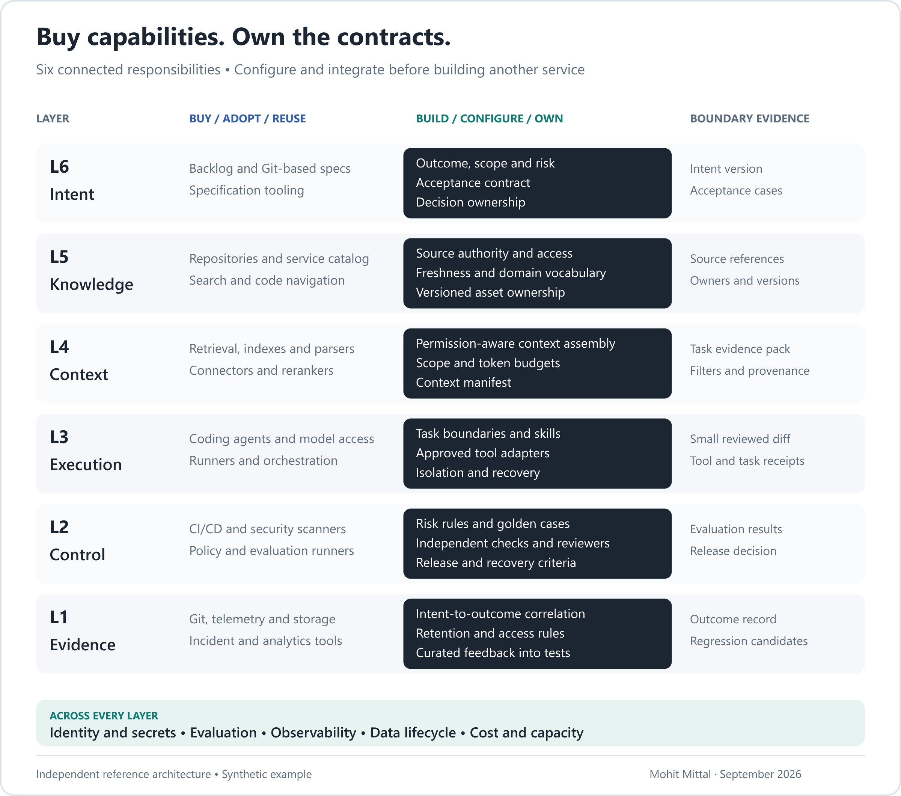
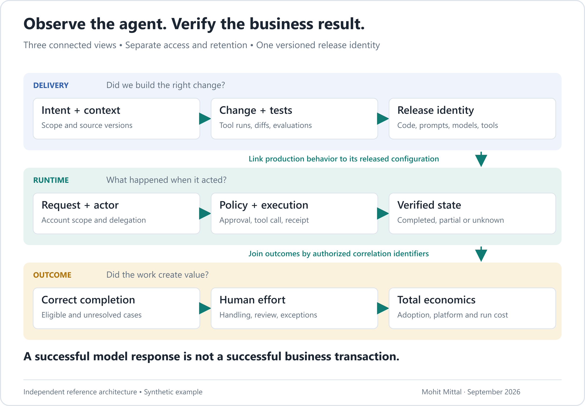

> Earlier delivery essay. The current six-layer architecture, tool map and integration contracts are in [Intent to Production](https://github.com/appliedgenai/intent-to-production). This repository’s main paper is [Earned Autonomy](README.md), on agent action authority.

# Intent-driven AI-DLC: implementation playbook

*Companion to [AI-DLC: From Intent to Evidence](03-intent-driven-ai-dlc.md) · Mohit Mittal · September 2026*

This is a proposed reference ecosystem for AI-assisted software delivery, including software that contains agents. It is not a procurement shortlist or a description of a deployed employer platform. Product examples establish that capabilities exist; they are not interchangeable or validated together as a single stack.

## 1. The build-versus-buy boundary

**Reuse first. Configure next. Integrate where necessary. Build a new service only when a demonstrated gap justifies its ongoing ownership.** “Adopt” includes open source, which still requires engineering and operating capacity.

Make the decision at a working interface. Can the existing product enforce the required permissions, emit usable evidence, support recovery and export the assets needed to switch later? Prove those behaviors with the same acceptance cases used for an internal option. Compare integration, support, migration and operating cost alongside license cost. Build a missing domain adapter when that closes the gap; replace the underlying platform only when the gap cannot be contained. Name the team that will maintain either choice.

### L6 · Intent and specification

**Buy/adopt:** the existing backlog, Git-based documentation, specification tooling and design collaboration. [Kiro specs](https://kiro.dev/docs/specs/) are one example of tooling for structured requirements, design and tasks. Keep a single authoritative specification even when several interfaces display it.

**Own:** a versioned intent contract covering the business result, eligible population, exclusions, risk, acceptance criteria, nonfunctional requirements, dependencies and accountable owner. A material change to intent triggers impact review; it must not silently leave downstream tests attached to an obsolete promise.

**Owner and exit evidence:** product owner with engineering and operations; approved intent plus acceptance-case identifiers. Risk partners join where the workflow needs them. For the address-change feature, completion is a verified update or an explicitly owned exception—not a successfully generated API call. See the [worked contract](examples/ai-dlc-intent.md).

### L5 · Authoritative knowledge

**Buy/adopt:** repositories, documentation, service catalogs, code navigation and enterprise search. [Backstage's software catalog](https://backstage.io/docs/features/software-catalog/) is an example for service ownership and metadata; it does not make a source authoritative merely by indexing it.

**Own:** source precedence, domain vocabulary, freshness rules and mappings from source permissions to consumer access. Register services, models, prompts, tools, skills and evaluation sets with versions and owners. Start with Git and catalog metadata when those suffice.

**Owner and exit evidence:** domain/service owners maintain their material; platform engineers maintain discovery interfaces. The output identifies the approved account API, verification policy, service owner and source versions. Conflicts have an escalation path. Avoid copying the whole wiki into a new store with weaker permissions.

### L4 · Task context

**Buy/adopt:** retrieval, indexes, parsers, connectors and rerankers. [Amazon Bedrock Knowledge Bases](https://docs.aws.amazon.com/bedrock/latest/userguide/knowledge-base.html) illustrates managed retrieval capabilities. Evaluate ingestion and permission behavior against your sources rather than assuming a connector preserves every entitlement.

**Own:** the context assembly policy: task scope, source selection, permission enforcement, recency, exclusions, token budget and a context manifest. Apply access restrictions before evidence reaches the model; protect caches and derived indexes against cross-user or cross-tenant reuse. Treat retrieved instructions as untrusted data.

**Owner and exit evidence:** platform retrieval engineers with domain evaluation owners; source references, versions, filters and missing-evidence flags. Test both whether the right rule is found and whether a user can retrieve another account's data. The knowledge layer answers “what is authoritative?” Context answers “what may this task see now?”

### L3 · Bounded execution

**Buy/adopt:** coding agents, model providers, isolated runners and established orchestration. [GitHub Copilot cloud agent](https://docs.github.com/en/copilot/concepts/agents/cloud-agent/about-cloud-agent) is one coding-agent example. [Temporal](https://docs.temporal.io/) is an option where durable, long-running workflow execution is needed; ordinary CI tasks do not all require another orchestration platform.

**Own:** task boundaries, workspace templates, reusable skills, tool adapters, checkpoints, budgets and stop conditions. A skill packages a procedure; it does not grant permission. Limit filesystem, network and secret access outside the model. Give agents typed interfaces and narrow credentials rather than unrestricted administrative tools.

**Owner and exit evidence:** engineering owns the change; platform engineering owns the execution environment. Deliver small diffs, receipts and a task result linked to intent. Buy the general harness where it fits; build adapters and domain controls that the harness cannot express. Separate development-agent identity from any identity used by agents in the shipped product.

### L2 · Evaluation, policy and release

**Buy/adopt:** CI/CD, security testing, policy evaluation and existing change controls. [GitHub deployment environments](https://docs.github.com/en/actions/reference/workflows-and-actions/deployments-and-environments) provide deployment-protection capabilities; availability varies by repository and plan. [OPA](https://www.openpolicyagent.org/docs) evaluates policy, while [Promptfoo](https://www.promptfoo.dev/docs/intro/) provides evaluation/testing capabilities. Neither supplies your business risk policy or a complete assurance argument.

**Own:** risk classification, golden cases, held-out cases, failure budgets, reviewer routing and release manifests. Combine deterministic tests, integration tests and human assessment with calibrated model judges where appropriate. The authoring agent cannot be the sole evaluator; another agent is not automatically an independent source of truth.

**Owner and exit evidence:** service owner accountable for release, with engineering/security/risk responsibilities defined by change class. Record evaluated code, prompt, model reference, tools, configuration and test-set versions. Stage rollout, verify preconditions and practice recovery. Model rollback cannot undo a business action already taken.

### L1 · Evidence and learning

**Buy/adopt:** version control, artifact/object storage, telemetry, incident management and analytics. [Langfuse](https://langfuse.com/docs) is an example of an AI engineering platform offering observability and evaluation capabilities. Pair the chosen tooling with the retention and access controls your records require.

**Own:** lineage from intent to change to release to outcome; evidence classification; capture coverage; and the process for curating feedback. Keep operational memory, authoritative knowledge and audit evidence logically distinct. They have different trust, access and retention requirements.

**Owner and exit evidence:** platform observability engineers maintain collection; service owners maintain operational interpretation; product owns outcome review. A failed address update becomes a labeled regression case only after review and redaction. A trace store is not automatically a compliant archive, and storing everything does not create useful learning.

## 2. The services underneath all six layers

| Shared capability | Minimum responsibility | Build/buy position |
|---|---|---|
| Identity and secrets | Workload identities, delegated access, scoped credentials and rotation | Reuse enterprise IAM and secret management; own resource/action mappings. |
| Model access | Approved endpoints, routing, quotas, residency and cost attribution | Adopt provider/gateway capabilities; own selection rules and fallback evaluations. |
| Tool access | Registry, schema, authorization, versioning, rate limits and receipts | Adopt transport/gateway capabilities; own domain adapters and business checks. |
| Execution infrastructure | Isolated environments, artifacts, dependency controls and deployment | Reuse cloud/platform and CI investment; own safe templates and environment policy. |
| Data lifecycle | Classification, lineage, retention, deletion and restricted evidence access | Use existing data/security controls; integrate their enforcement into AI paths. |
| Observability and evaluation | Correlated signals, quality labels, alerts and incident feedback | Adopt collection/analysis; own business semantics and the response runbook. |

No gateway should become a universal administrator. Destination services retain enforcement. Avoid routing every interaction through a new central service when existing controls already satisfy the contract.

**Model selection:** use evaluated extraction/classification models for bounded tasks and stronger reasoning models where complexity warrants them. Use deterministic code for authorization, arithmetic and transaction invariants. Evaluate fallback models as separate behavior; a routing switch can change quality even when the API shape stays constant. Training a proprietary foundation model is not a prerequisite for this ecosystem.

## 3. People: explicit accountability without a central approval queue

| Role | Accountable contribution | What changes with AI |
|---|---|---|
| Product owner | Intent, exclusions and business success | Reviews assumptions and acceptance evidence rather than treating prompt text as a requirement. |
| Domain expert / operations | Real exceptions, labels and supportability | Contributes test cases and recovery scenarios before generation starts. |
| Engineer / architect | Design, correctness and maintainability | Decomposes work, checks boundaries, reviews diffs and owns what is merged. |
| Platform team | Reusable interfaces and reliable environments | Makes compliant delivery easy without owning every domain decision. |
| Security / risk partner | Applicable constraints and exception decisions | Uses proportionate controls and evidence instead of reviewing every trivial edit. |
| Evaluation owner | Test-set integrity, coverage and interpretation | Maintains held-out cases and checks evaluator error; this can be a responsibility within an existing team. |
| Service owner / SRE | Release, operations and recovery | Watches agent behavior and business outcomes alongside service health. |

Non-coders can author intent, supply labeled examples and build sandboxed prototypes. Production ownership does not disappear when code generation becomes accessible. Maintain apprenticeship, paired review and domain-learning time; teams still need people capable of diagnosing a wrong result.

## 4. Process: one request through five decisions

1. **Agree intent.** Product, engineering and operations expose ambiguity and define exclusions. Exit with a versioned contract, a named owner and a measurable baseline.
2. **Agree the design.** Validate dependencies, architecture decisions, data boundaries and failure behavior. Run technical spikes for unknowns before committing to automation scope.
3. **Construct in small slices.** An agent proposes changes inside a bounded environment. Humans resolve material ambiguity. Tests and review progress with the change; do not accumulate a large unreviewed batch.
4. **Release a known bundle.** Promote evaluated artifacts through test environments and a controlled cohort. Record versions and practice stop/recovery behavior. A green coding-agent run is not release authorization.
5. **Review the outcome.** Compare quality, effort, cost and lead time. Route incidents to owners, curate new tests and amend intent when the business changes. Retire obsolete prompts, models, credentials and data according to policy.

Scale the ceremony to the risk. A documentation edit and a change to account authorization need different evidence. Avoid rebuilding waterfall as a series of AI-assisted approval meetings.

## 5. Patterns, anti-patterns and their costs

| Pattern to use | Anti-pattern to avoid | Why it matters / tradeoff |
|---|---|---|
| Versioned intent with acceptance examples | A long prompt treated as the contract | Makes ambiguity reviewable; requires product and domain participation. |
| Permission-aware, task-sized context | “Connect everything” retrieval | Reduces exposure and irrelevant evidence; needs source ownership and access-aware caching. |
| Small diffs and review work-in-progress limits | Parallel agents generating faster than humans can review | Protects reviewer capacity; agent utilization may be deliberately lower. |
| Independent evidence and held-out tests | The same agent writes code and declares it correct | Reduces correlated mistakes; evaluation costs time and needs maintained labels. |
| Deterministic workflow with narrow agent tasks | Multiple agents for a predictable sequence | Simplifies recovery; reserves flexible reasoning for tasks that benefit from it. |
| One governed interface per reusable capability | A cloned harness for every team | Lowers repeated integration work; requires stable contracts and a platform roadmap. |
| Versioned release and evaluated fallback | Silent prompt/model substitution | Makes regressions diagnosable; demands lifecycle ownership even for purchased services. |
| Curated failure-to-test feedback | Feeding all production traces into memory | Preserves trust and privacy; useful learning requires review, not just storage. |
| Failure-state visibility and owned exceptions | “Success” measured as a completed model response | Connects service health to business completion; needs domain-specific instrumentation. |

These are engineering recommendations and failure scenarios to test. They are not presented as incidents observed at a named employer.

## 6. Observability: three views, one release identity

**Delivery view:** intent ID/version → context manifest → agent task/tool receipts → code change → test evidence → approval → release manifest. Diagnose missing knowledge, repeated failed attempts, review queues and expensive generation.

**Runtime view:** business request → actor/delegation → tool call → policy/approval → destination receipt → reconciliation. Diagnose latency, denied operations, retries, partial completion and unknown state.

**Outcome view:** eligible requests, correct completion, human handling and exceptions, adoption and cost. An inference span ending successfully is not a completed account-maintenance request.

Correlate with stable identifiers and explicit parent/child relationships where valid. Use links when asynchronous work crosses trace boundaries. Protect delivery and customer telemetry with separate access and retention. Do not use client details as metric labels or record secrets and hidden model reasoning. Record concise decision factors and controlled evidence references.

[OpenTelemetry's GenAI conventions](https://github.com/open-telemetry/semantic-conventions-genai) cover relevant telemetry concepts; parts remain in development. Pin the convention/instrumentation version and map business-specific events deliberately. Measure capture gaps: missing traces must not be counted as successful outcomes. Sample routine diagnostic detail by policy while preserving the required evidence for consequential decisions. Observability needs an owner and a response, not only a dashboard.

## 7. Metrics with definitions that survive scrutiny

Use the service/workflow as the unit of comparison. Capture the baseline before changing the process and disclose cohort selection. Track cancelled and abandoned work separately so a shrinking denominator cannot manufacture improvement.

| Measure | Definition and source | What it tells you |
|---|---|---|
| Intent-to-production time | Elapsed time from agreed intent to production availability; backlog/spec plus deployment records; median and p90 | Whole delivery delay. Report time spent clarifying before approval separately. |
| Review waiting time | Sum of intervals a change is ready for human review but not actively reviewed; PR/workflow events | Whether faster generation has moved the bottleneck. Keep active review effort separate. |
| First-pass acceptance | Changes accepted on first substantive review without requested revision / changes reaching that review | Rework signal; interpret by risk and complexity so rubber-stamping does not look successful. |
| Change fail rate | Deployments requiring immediate intervention / deployments, per agreed incident policy | Delivery instability; identify rollback/hotfix consistently. |
| Failed deployment recovery time | Time from a failed deployment to restored service | Recovery performance; pair with incident severity and sample counts. |
| Total cost per accepted change | Human work, allocated tooling/platform cost and agent execution cost across all attempts / accepted changes in the cohort | Economics including rejected attempts, not just inference spend. Allocate unfinished work consistently. |
| Evidence completeness | Required decision/release records present and valid / records expected by policy | Whether a success claim is reconstructable. Validate fields and links, not just log counts. |
| Verified workflow completion | Requests confirmed correct in authoritative state / eligible requests in a matured cohort | Business reliability; pending/unknown cases remain visible and are not quietly removed. |
| Human minutes per eligible request | Handling + review + exception + rework effort / eligible requests in the same cohort | Capacity actually released. Separate one-time setup and ongoing oversight. |
| Adoption and exception age | Used assisted path / eligible opportunities; median/p90 age and count of open exceptions | Whether the capability is used and whether work is accumulating elsewhere. |

The two deployment measures above follow [DORA definitions](https://dora.dev/guides/dora-metrics/). Intent lead time, first-pass acceptance and evidence completeness are additional proposed measures, not DORA metrics. DORA also tracks deployment frequency, change lead time and deployment rework rate; retain those where already established.

### Worked example: cheaper construction is not yet faster delivery

**Illustrative arithmetic only. These are not employer results, targets or a forecast.** For a similarly scoped accepted change:

| Human effort | Baseline | AI-assisted |
|---|---:|---:|
| Implementation | 20 hours | 8 hours |
| Review and validation | 8 hours | 9 hours |
| Rework | 2 hours | 3 hours |
| **Total** | **30 hours** | **20 hours** |

Implementation effort falls 60%; total human effort falls 33%. At an illustrative $100/hour and $200 incremental AI cost per accepted change, direct cost moves from $3,000 to $2,200: about 27% lower before shared platform and oversight costs. Those must be allocated before claiming net savings.

If review queues and the release calendar still make elapsed delivery time six days, lead-time improvement is zero. If advisors do not adopt the feature, realized advisor capacity is also zero. The three claims must remain separate.

For a pilot, compare similar work in the same service using a staged rollout or matched cohorts. Show sample sizes, the distribution of outcomes, staffing changes and concurrent process changes. Observational before/after results do not isolate the effect of AI. Do not infer a low rare-event failure rate from a small pilot with zero failures.

## 8. Deliver the smallest complete ecosystem

**First establish:** one workflow, one owner, its baseline, source inventory and intent contract. Reuse the existing repository, backlog and CI.

**Then connect:** bounded agent execution, task context, independent tests, release evidence and operational telemetry. Exercise stale data, denied access, dependency failure and rollback/reconciliation in an isolated environment.

**Then operate:** a controlled cohort, staffed exceptions and an outcome review. Continue only if quality and workload remain acceptable under agreed thresholds.

**Then reuse:** onboard a second domain through the same templates and interfaces. Measure how much custom integration it needs. If every new use case requires a new platform branch, fix the abstraction before broad rollout.

This is a complete ecosystem in responsibilities and feedback loops. It is intentionally not a requirement to purchase a large toolchain before learning whether one workflow creates value.

[Return to the article](03-intent-driven-ai-dlc.md) · [Source notes](SOURCES.md)
