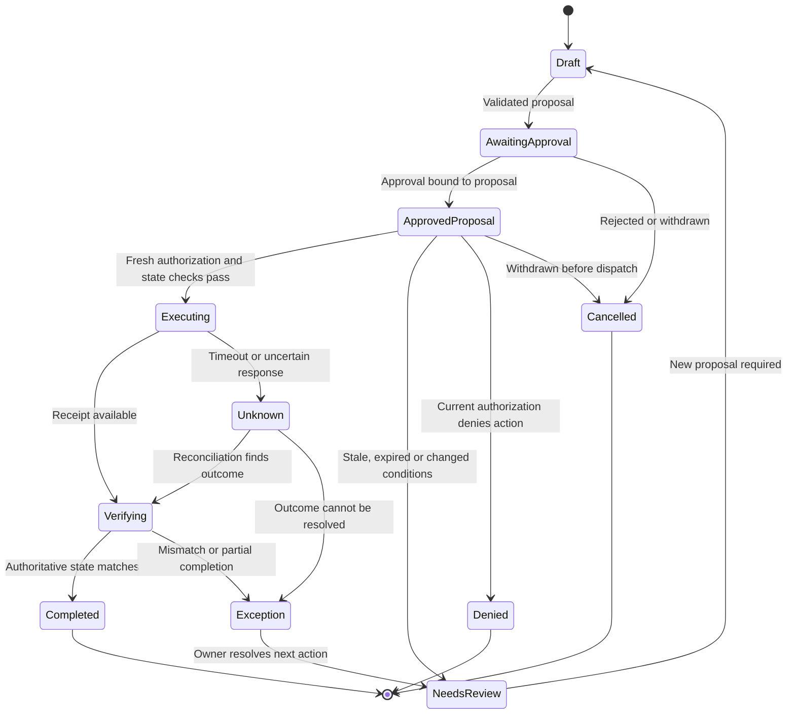

# One workflow, end to end

## AI-assisted account maintenance

**Design exercise, not a deployed implementation.** All identifiers and scenarios are synthetic. The goal is to demonstrate the decisions behind the articles, including where automation must stop.

### Scope and outcome

Prepare and submit a mailing-address maintenance request for an eligible account after required verification and human approval. Existing fraud, identity, jurisdiction and business controls remain authoritative. Exclude trades, money movement, investment advice, beneficiary changes and any case the policy classifies as ineligible.

Completion means the approved change is reflected in the authoritative account service, the downstream receipt is linked to the operation, and the advisor sees a confirmed result. Receipt of an HTTP response alone is insufficient.

### Action contract

See [action-contract.json](examples/action-contract.json). It specifies fields the implementation would have to enforce. It is not an executable policy, a JSON Schema or an OAuth specification.

The workflow has these states:

Persist transitions durably. Distinguish a known rejection from an unknown outcome. The operation key binds the account, proposal and action; repeated requests with a different payload must be rejected, not treated as equivalent.

Cancellation before dispatch does not prove cancellation of an in-flight side effect. Once execution begins, the stop/reconciliation runbook determines whether the destination can cancel, must finish, or needs an owned exception.

### Architectural decisions and their costs

| Decision | Why | Cost or limitation |
|---|---|---|
| Agent prepares; workflow executes | Keeps open-ended reasoning outside write authority. | Requires explicit domain APIs and workflow ownership. |
| Approval binds to proposal and relevant record version | Prevents a valid approval from authorizing a later, different action. | Concurrent updates can require another review. |
| Conditional write plus idempotency support | Limits stale updates and duplicate effects. | Depends on destination semantics; adapters cannot manufacture guarantees. |
| Evidence store separated from ordinary telemetry | Controls access and retention of sensitive records. | More operational complexity and explicit correlation IDs. |
| Conservative fallback on policy outage | Avoids accidental expansion of authority. | Reduced availability; the manual path must be staffed. |

For a destination without conditional writes or reliable operation lookup, begin in draft-only mode. Broader execution requires a defensible serialization/reconciliation design and acceptance of the remaining risk by the accountable owners.

### What the review screen must show

Show the account identifier appropriate to the user's access, before/after fields, required verification status, provenance, unresolved warnings and expiry. State exactly what approval will initiate. A reviewer cannot approve a hidden expansion of the requested change.

Show unresolved and partially completed work prominently. The advisor should never receive a success message while operations is silently reconciling the result.

### Evaluation before expansion

The [evaluation cases](examples/evaluation-cases.json) define expected business outcomes for eight failure modes. They are a test specification, not executed tests.

An implemented test harness should assert downstream state, number of side effects, policy decisions and evidence records. Stub destination failures deterministically, then test integrations in an isolated environment. Add representative cases labeled by operations; reserve a held-out set and report performance by risk class.

Before a supervised pilot, require no unauthorized writes or duplicate effects in the defined security/reliability suite, owned exception routing, working reconciliation, verified evidence access controls and a rehearsed stop procedure. Passing that suite does not establish a real-world failure-rate guarantee.

### A staged first 90 days

This is a sequencing proposal. Advancement depends on evidence, not the calendar.

| Window | Deliverable | Decision at the end |
|---|---|---|
| Days 1–30 | Baseline human effort; inventory permissions and API behavior; define action contract and failure tests. | Is this workflow suitable, and are the destination guarantees sufficient? |
| Days 31–60 | Shadow proposals; reviewer experience; deterministic execution in an isolated environment; reconciliation and stop drills. | Are quality, control coverage and operational ownership good enough for supervised use? |
| Days 61–90 | Small approved cohort with human approval and staffed exceptions; matched comparison of end-to-end effort and quality. | Expand, narrow or stop based on observed outcomes and agreed risk thresholds. |

Agree thresholds with the business, operations and risk owners before looking at pilot results. Keep the baseline definition, failure denominator and selection criteria fixed enough for a meaningful comparison.

### Scorecard

- **Business:** human handling minutes per eligible request, resolution time, abandonment and advisor adoption.
- **Quality:** verified correct completion, rework and unresolved outcomes by cohort.
- **Control:** unauthorized attempts blocked, unauthorized effects, stale approvals and duplicate effects.
- **Operations:** exception age, review queue load, recovery time and stop/reconciliation drill outcomes.
- **Economics:** total workflow cost, including inference, infrastructure, review, oversight and exceptions.

The first expansion should prove that another action can reuse the platform contracts. It should not require copying a bespoke harness and its operational burden.

[Back to portfolio](README.md)
