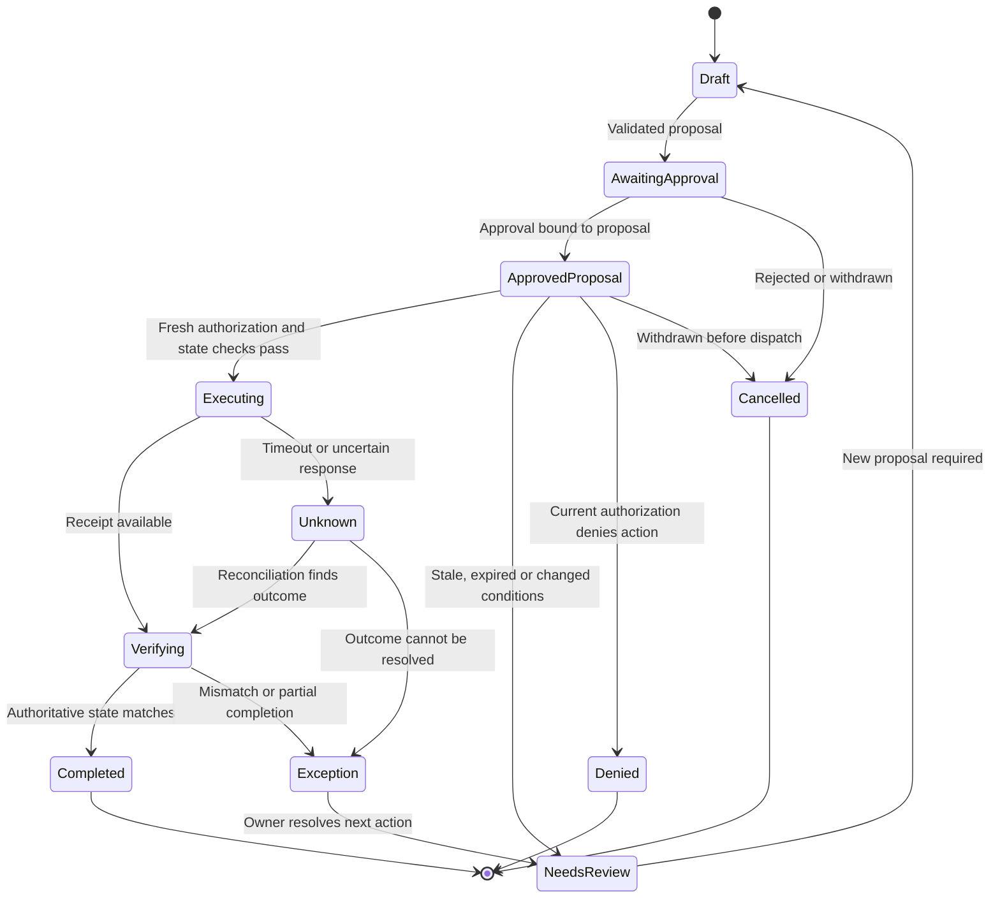
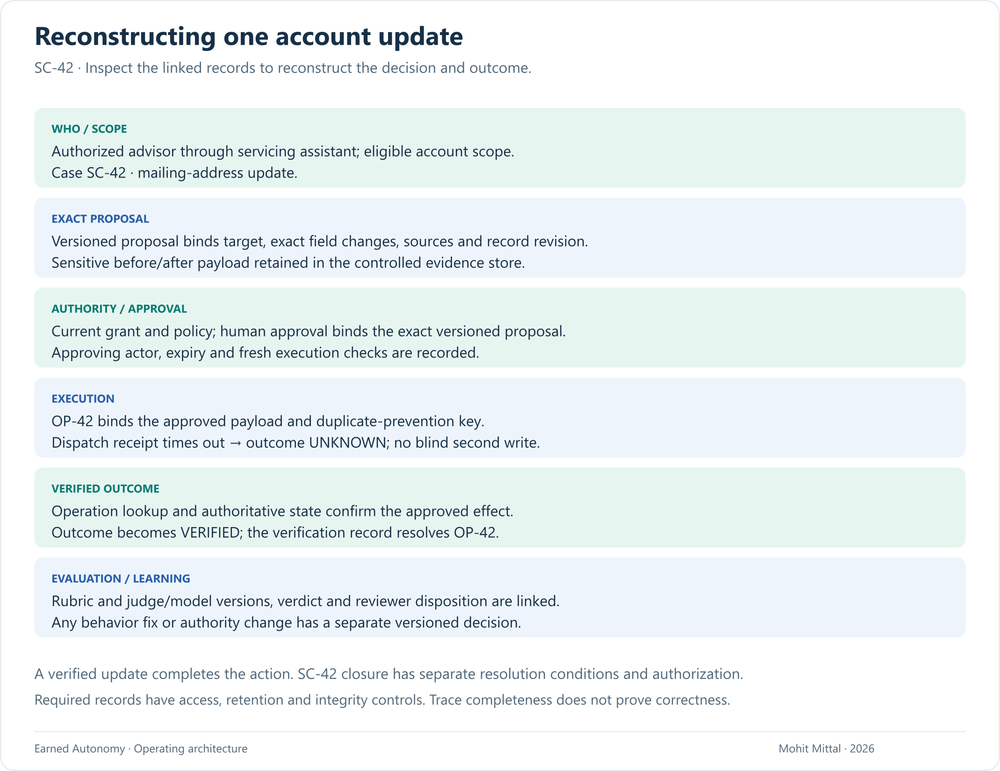

# SC-42: from service-case investigation to verified action

## A bounded investigation with a controlled account-maintenance step

**Design exercise, not a deployed implementation.** All identifiers and scenarios are synthetic. The goal is to demonstrate the decisions behind the articles, including where automation must stop.

### Why the investigation uses an agent

An advisor asks why service case SC-42 remains open. The agent checks permitted case history, account status and supporting records, follows discrepancies within its tool scope, and assembles a resolution package. A possible mailing-address mismatch is evidence to investigate, not authorization to change the account. Missing or conflicting policy evidence goes to the domain owner.

The variable investigation may benefit from an agent; the address change below is a deterministic execution step. Compare the investigation against a fixed checklist plus extraction before choosing the more complex approach. This proposal retains human approval for the address action.

### Scope and outcome

Prepare and submit a mailing-address maintenance request for an eligible account after required verification and human approval. Existing fraud, identity, jurisdiction and business controls remain authoritative. Exclude trades, money movement, investment advice, beneficiary changes and any case the policy classifies as ineligible.

Action completion means the approved change is reflected in the authoritative account service, the downstream receipt is linked to the operation, and the advisor sees a confirmed result. Receipt of an HTTP response alone is insufficient. SC-42 closes only when the servicing workflow's separate resolution conditions are satisfied and closure is authorized and confirmed. The state machine below describes the account action, not whole-case closure.

### Action contract

See [action-contract.json](examples/action-contract.json). It specifies fields the implementation would have to enforce. It is not an executable policy, a JSON Schema or an OAuth specification.

The workflow has these states:

Persist transitions durably. Distinguish a known rejection from an unknown outcome. The operation key binds the account, proposal and action; repeated requests with a different payload must be rejected, not treated as equivalent.

Cancellation before dispatch does not prove cancellation of an in-flight side effect. Once execution begins, the stop/reconciliation runbook determines whether the destination can cancel, must finish, or needs an owned exception.

### Architectural decisions and their costs

| Decision | Why | Cost or limitation |
|---|---|---|
| Agent prepares; workflow executes | Keeps open-ended reasoning outside write authority. | Requires explicit domain APIs and workflow ownership. |
| Approval binds to proposal and relevant record version | Prevents a valid approval from authorizing a later, different action. | Concurrent updates can require another review. |
| Conditional write plus idempotency support | Limits stale updates and duplicate effects. | Depends on destination semantics; adapters cannot manufacture guarantees. |
| Evidence store separated from ordinary telemetry | Controls access and retention of sensitive records. | More operational complexity and explicit correlation IDs. |
| Conservative fallback on policy outage | Avoids accidental expansion of authority. | Reduced availability; the manual path must be staffed. |

For a destination without conditional writes or reliable operation lookup, begin in draft-only mode. Broader execution requires a defensible serialization/reconciliation design and acceptance of the remaining risk by the accountable owners.

### A reconstructable decision record

The figure uses synthetic identifiers and redacted payload references. It records operation `OP-42` first as unknown after a timeout, then verified after lookup and state comparison. Reconstruction inspects retained evidence; it does not repeat the live side effect. Store the exact approved payload securely, including the approving actor, grant and policy bindings.

### What the review screen must show

Show the account identifier appropriate to the user's access, before/after fields, required verification status, provenance, unresolved warnings and expiry. State exactly what approval will initiate. A reviewer cannot approve a hidden expansion of the requested change.

Show unresolved and partially completed work prominently. The advisor should never receive a success message while operations is silently reconciling the result.

### Evaluation before expansion

The [evaluation cases](examples/evaluation-cases.json) define expected behavior for execution, semantic-evaluation and authority-change failure modes. They are a test specification, not executed tests.

An implemented test harness should assert downstream state, number of side effects, policy decisions and evidence records. Stub destination failures deterministically, then test integrations in an isolated environment. Add representative cases labeled by operations; reserve a held-out set and report performance by risk class.

Before a supervised pilot, require no unauthorized writes or duplicate effects in the defined security/reliability suite, owned exception routing, working reconciliation, verified evidence access controls and a rehearsed stop procedure. Passing that suite does not establish a real-world failure-rate guarantee.

### Semantic evaluation and grant changes

The four modes and [worked grant review](earned-autonomy-operating-model.md#one-action-through-the-four-modes) apply to a specific action/cohort. [The agent profile](examples/agent-profile.json) binds this servicing investigator to the shared harness. [The authority-review example](examples/authority-review.json) records why a proposed A3 grant remains at A2. The console records requested restrictions separately from shared-harness confirmation and in-flight reconciliation. The illustrated temporary hold covers new address updates for SC-42 only; other cases retain their existing grants.

For the resolution package, use a rubric covering source support, omitted contradictions, unresolved facts and the appropriateness of escalation. An LLM judge or structured decision model is a candidate evaluator, calibrated against independently adjudicated domain cases. Permission, payload, date and final-state checks remain deterministic. Required evaluator failure takes the action's defined hold/review path; a high score never grants write permission.

The separate `create_internal_case` action creates a linked internal specialist follow-up for SC-42 and starts approval-required. Restrict it to draft-only or expand it to bounded execution only through an owner-approved, versioned grant for the same action and cohort, subject to predefined emergency restriction controls. SC-42's account update remains approval-required. Improvements to sources, prompts, tools or models have their own evaluation and rollout decision. See the [full evaluation and authority loop](earned-autonomy-operating-model.md#two-feedback-loops-two-decisions).

### Value sizing

Size the whole investigation/resolution workflow, then evaluate the incremental value of promoting follow-up creation from A2 to A3. Use comparable case populations and mature outcome windows. Keep address updates approval-gated in this evaluation.

**Monthly gross capacity value = N × m × r ÷ 60 × H.**

**Monthly net capacity value = gross capacity value − R − E − P − G.**

| Input | Meaning | Value to supply |
|---|---|---|
| N | Eligible cases/month, using fixed eligibility rules. | [ILLUSTRATIVE — replace with real data: eligible monthly volume] |
| m | Baseline handling minutes/case for the work expected to be removed. | [ILLUSTRATIVE — replace with real data: handling minutes] |
| r | Expected gross reduction, as a fraction; replace with observed results after evaluation. | [ILLUSTRATIVE — replace with real data: reduction assumption] |
| H | Loaded cost in dollars/hour for the affected work. | [ILLUSTRATIVE — replace with real data: hourly cost] |
| R | Incremental review cost, dollars/month. | [ILLUSTRATIVE — replace with real data: review cost] |
| E | Incremental exception/recovery/rework cost, dollars/month. | [ILLUSTRATIVE — replace with real data: exception cost] |
| P | Incremental model, evaluator, runtime and platform cost, dollars/month. | [ILLUSTRATIVE — replace with real data: platform cost] |
| G | Incremental governance-program cost, dollars/month. | [ILLUSTRATIVE — replace with real data: governance cost] |

Count each item once. If r already measures net handling reduction including review and recovery, exclude those included items from R/E. Preserve unsuccessful and abandoned attempts in cohort costs; disclose pending outcomes. Implementation cost and the 90-day budget are separate one-time investment inputs. Report both observed hours released and their monetary valuation; a cash-savings claim additionally needs an actual spending reduction.

For the A2-to-A3 decision, compare approval effort removed with added audit, exception and queue effort for the same follow-up cohort. Do not credit that promotion with investigation benefits already present under A2. Select a different action if the incremental benefit cannot cover its control and operating burden.

### A staged first 90 days

The operations sponsor owns the outcome. A platform lead owns execution and recovery; domain reviewers define correct results; evaluation and risk partners set entry criteria. Staff allocation and budget cap: [ILLUSTRATIVE — replace with real data: roles, allocation and 90-day investment]. Advance only when entry criteria pass.

| Window | Deliverable | Decision at the end |
|---|---|---|
| Days 1–30 | Baseline human effort; inventory permissions and API behavior; define action contract and failure tests. | Is this workflow suitable, and are the destination guarantees sufficient? |
| Days 31–60 | Shadow proposals; reviewer experience; deterministic execution in an isolated environment; reconciliation and stop drills. | Are quality, control coverage and operational ownership good enough for supervised use? |
| Days 61–90 | Small approved cohort with human approval and staffed exceptions; matched comparison of end-to-end effort and quality. | Deliver observed economics, control-test results, gaps, an operating owner and an expand/narrow/stop recommendation. |

Agree thresholds with the business, operations and risk owners before looking at pilot results. Keep the baseline definition, failure denominator and selection criteria fixed enough for a meaningful comparison.

### Scorecard

- **Business:** human handling minutes per eligible request, resolution time, abandonment and advisor adoption.
- **Quality:** verified correct completion, rework and unresolved outcomes by cohort.
- **Control:** unauthorized attempts blocked, unauthorized effects, stale approvals and duplicate effects.
- **Operations:** exception age, review queue load, recovery time and stop/reconciliation drill outcomes.
- **Economics:** total workflow cost, including inference, infrastructure, review, oversight and exceptions.

The first expansion should prove that another action can reuse the platform contracts. It should not require copying a bespoke harness and its operational burden.

[Back to portfolio](README.md)
